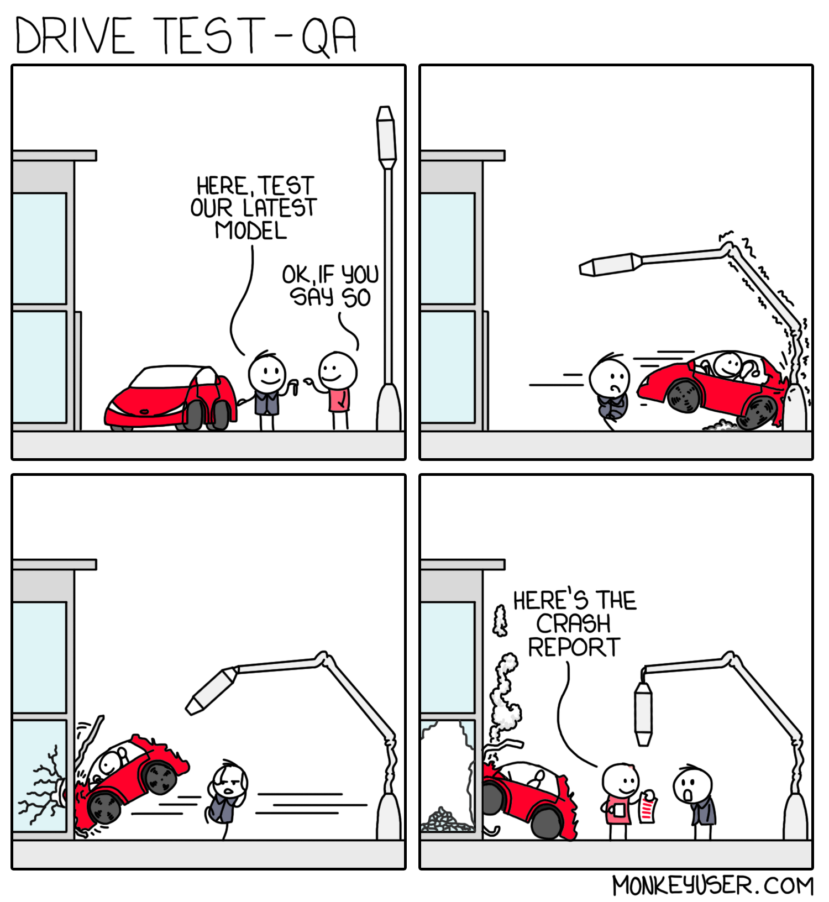
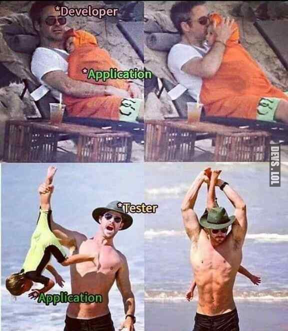

class: center, middle

# `hypothesis` & Property-Based Testing

???

Temat: framework `hypothesis` i trochę testowania ogólnie... a właściwie to na odwrót. 

---
class: center, title-image

# Software testing



???

Trochę o testowaniu, żebyśmy mieli wspólny punkt wyjścia.


---

## Software testing

.row[
.column[
"Software testing is the act of examining the artifacts and the behavior of the software under test
by validation and verification." 

    Verification: Are we building the product right?
    Validation: Are we building the right product?

]

.column[
.center[

]
]
]

???
W skrócie o testowaniu - o co chodzi. 

Weryfikacja - zgodnie z designem, walidacja - zgodnie z wymaganiami klienta.

Developerzy mają tendencję do sprawdzania tylko 'happy path'

---

## A software tester walks into a bar...

--

.row[
.column[
- Runs into a bar.
- Crawls into a bar.
- Dances into a bar.
- Flies into a bar.
- Jumps into a bar.

And orders:

- a beer.
- 2 beers.
- 0 beers.
- 99999999 beers.
- a lizard in a beer glass.
- -1 beer.
- "qwertyuiop" beers.

✔️ Testing complete 
]

.column[

]
]

???

Klasyczny dowcip (suchar?) na początek.

---

## A real customer walks into the bar...

.row[
.column[

... and asks where the bathroom is.

]
]

---
## A real customer walks into the bar...

.row[
.column[
... and asks where the bathroom is.

🔥🔥 The bar goes up in flames 🔥🔥
]
.column[

]
]

???

Nie testujemy tylko 'happy path'... ale i to nie pomaga. 100% line coverage też nie.

---

# Testing techniques

https://en.wikipedia.org/wiki/Test_design_technique

* Boundary Value Analysis
* Equivalence Partitioning
* State Transition
* Decision Table
* Error Guessing (experience-based)
* [Combinatorial testing](https://hexawise.com/software-testing-glossary#combinatorial-testing)
* Property-based Testing
* ...

???

Metody projektowania testów są różne.

---

## Example test - what can we test here and how?

.row[
.column[
```python
import math

def factorize(number: int) -> list[int]:
    if number in [-1, 0, 1]:
        return [number]
    if number < 0:
        return [-1] + factorize(-number)
    factors = []

    # Treat the factor 2 on its own
    while number % 2 == 0:
        factors.append(2)
        number = number // 2
    if number == 1:
        return factors

    # Now we only need to check uneven numbers
    # up to the square root of the number
    i = 3
    while i <= int(math.ceil(number ** 0.5)) + 1:
        while number % i == 0:
            factors.append(i)
            number = number // i
        i += 2
    return factors
```
]
.column[
```python
# Third party modules
import pytest

# First party modules
from factorize import factorize

@pytest.mark.parametrize(
    "n,expected",
    [
        (0, [0]),  # 0
        (1, [1]),  # 1
        (-1, [-1]),  # -1
        (-2, [-1, 2]),  # A prime, but negative
        (2, [2]),  # Just one prime
        (3, [3]),  # A different prime
        (6, [2, 3]),  # Different primes
        (8, [2, 2, 2]),  # Multiple times the same prime
    ],
)
def test_factorize(n, expected):
    assert factorize(n) == expected
```

.right[.small[[Source article](https://levelup.gitconnected.com/unit-testing-in-python-property-based-testing-892a741fc119)]]

]
]

???

Jak to przetestować?

Ten test jest fajny, ale pula możliwych wejść do funkcji jest duuuuża...

---

# Property-based Testing

We focus on testing _properties_ of code

A _property_ can be thought of as a requirement/part of a contract.

e.g.

    for all integers (x)
    there exists a set of prime integers (f1, f2, f3...) that sum up to the value of x

--

But how do we test them?

---
class: center

# `hypothesis`

---
## What is `hypothesis`?

https://hypothesis.works/

"Hypothesis is a modern implementation of property based testing, designed from the ground up for mainstream languages.

Hypothesis runs your tests against a much wider range of scenarios than a human tester could, finding edge cases in 
your code that you would otherwise have missed. It then turns them into simple and easy to understand failures that 
save you time and money compared to fixing them if they slipped through the cracks and a user had run into them 
instead."

---
## how does it work?

[Anatomy of a `hypothesis` test](https://hypothesis.works/articles/anatomy-of-a-test/)

* applies random examples guided by `@given` strategies (integers, strings, etc.) until failure or exhaustion
  * [What can you generate and how?](https://hypothesis.readthedocs.io/en/latest/data.html)
  * Exhaustion happens by default after 100 random examples (can be adjusted)
* if failing example is found, `hypothesis` tries to "shrink" it (find a simpler version of it)
  * e.g. `-10` -> `0`

---

## `hypothesis` example

.row[
.column[
```python
# Third party modules
import pytest

# First party modules
from factorize import factorize

@pytest.mark.parametrize(
    "n,expected",
    [
        (0, [0]),  # 0
        (1, [1]),  # 1
        (-1, [-1]),  # -1
        (-2, [-1, 2]),  # A prime, but negative
        (2, [2]),  # Just one prime
        (3, [3]),  # A different prime
        (6, [2, 3]),  # Different primes
        (8, [2, 2, 2]),  # Multiple times the same prime
    ],
)
def test_factorize(n, expected):
    assert factorize(n) == expected
```
]
.column[
```python
# Third party
import hypothesis.strategies as some
from hypothesis import given

# First party
from factorize import factorize

@given(some.integers(min_value=-(10 ** 6), max_value=10 ** 6))
def test_factorize_multiplication_property(n):
    factors = factorize(n)
    product = 1
    for factor in factors:
        product *= factor
    assert product == n, f"factorize({n}) returned {factors}"
```
.right[.small[[Source article](https://levelup.gitconnected.com/unit-testing-in-python-property-based-testing-892a741fc119)]]
]
]

???

Wytłumaczyć test

---

## What can we generate?
   
.row[
.column[
```
 binary
 booleans
 builds
 characters
 complex_numbers
 composite
 data
 dates
 datetimes
 decimals
 deferred
 dictionaries
 emails
 fixed_dictionaries
 floats
 fractions
 from_regex
 from_type
 frozensets
 functions
 integers
 ip_addresses
```
]
.column[
```
 iterables
 just
 lists
 none
 nothing
 one_of
 permutations
 random_module
 randoms
 recursive
 runner
 sampled_from
 sets
 shared
 slices
 text
 timedeltas
 times
 timezone_keys
 timezones
 tuples
 uuids
```
]
]
          
[Documentation](https://hypothesis.readthedocs.io/en/latest/data.html)

---
             
## Nice features: generating objects

```python
from typing import Dict, Optional
from dataclasses import dataclass
from hypothesis import strategies as st

@dataclass
class PdfInfo:
    path: str
    is_errorneous: bool
    is_encrypted: bool
    nb_pages: int
    nb_toc_top_level: int
    nb_characters: int
    user_attributes: Dict[str, Optional[str]]

# Usage in test to generate one PdfInfo: @given(st.builds(PdfInfo))

# Now show some samples:
for _ in range(10):
    print(st.builds(PdfInfo).example())

##########
# Output #
##########
# PdfInfo(path='', is_errorneous=False, is_encrypted=True,
#         nb_pages=0, nb_toc_top_level=0, nb_characters=0, user_attributes={})
...
```

---

## Nice features: ghostwriting tests

https://hypothesis.readthedocs.io/en/latest/ghostwriter.html

    Writing tests with Hypothesis frees you from the tedium of deciding on and writing out specific inputs to test. 
    Now, the hypothesis.extra.ghostwriter module can write your test functions for you too!
    
    The idea is to provide an easy way to start property-based testing, and a seamless transition to more complex
    test code - because ghostwritten tests are source code that you could have written for yourself.
    
    So just pick a function you’d like tested, and feed it to one of the functions below. (...)
--
```python
# This test code was written by the `hypothesis.extra.ghostwriter` module
# and is provided under the Creative Commons Zero public domain dedication.
import re

from hypothesis import given, reject, strategies as st

# TODO: replace st.nothing() with an appropriate strategy


@given(pattern=st.nothing(), flags=st.just(0))
def test_fuzz_compile(pattern, flags):
    try:
        re.compile(pattern=pattern, flags=flags)
    except re.error:
        reject()

```

---

## Where it could help us?

* [Fuzzing APIs](https://hypothesis.readthedocs.io/en/latest/examples.html#fuzzing-an-http-api)
* Testing functions with huge possible input number
* Finding corner cases and logic flaws
* Expand the coverage by testing with more examples.
* (Maybe) make preparing tests easier by ghostwriting tests.
* ...

---

# References

* [M. Thoma "Property-based Testing with Python"](https://levelup.gitconnected.com/unit-testing-in-python-property-based-testing-892a741fc119)
* [hypothesis main page](https://hypothesis.works)
* [Wiki on Software Testing](https://en.wikipedia.org/wiki/Software_testing)
* [Software Engineering | Verification and Validation](https://www.geeksforgeeks.org/software-engineering-verification-and-validation/)

---
class: center
background-image: url(img/seal.jpg)

# Thank you!

---

# Q&A

<hr />

```python
# Third party
import hypothesis.strategies as some
from hypothesis import given

# First party
from factorize import factorize

@given(some.integers(min_value=-(10 ** 6), max_value=10 ** 6))
def test_factorize_multiplication_property(n):
    factors = factorize(n)
    product = 1
    for factor in factors:
        product *= factor
    assert product == n, f"factorize({n}) returned {factors}"
```

<hr />
Q: How `hypothesis` caches examples in CI?

A: Example database can be shared through git repository or by using Redis, or something else - see 
[here](https://hypothesis.readthedocs.io/en/latest/database.html#exampledatabase-implementations)
  
<hr/>

.center[Your questions?]
